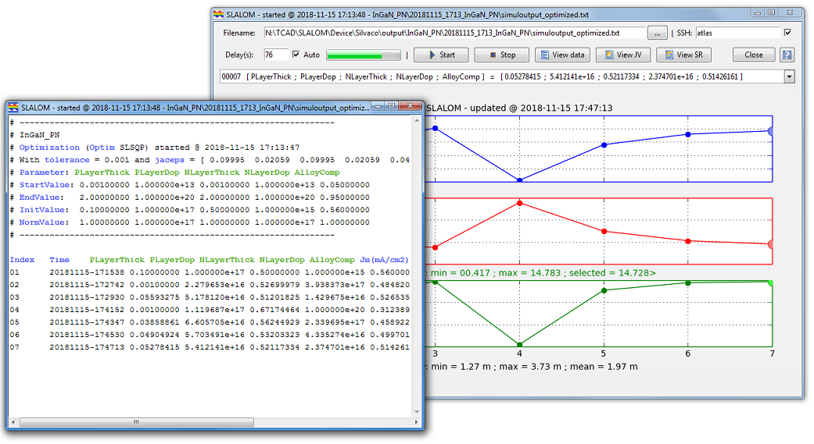
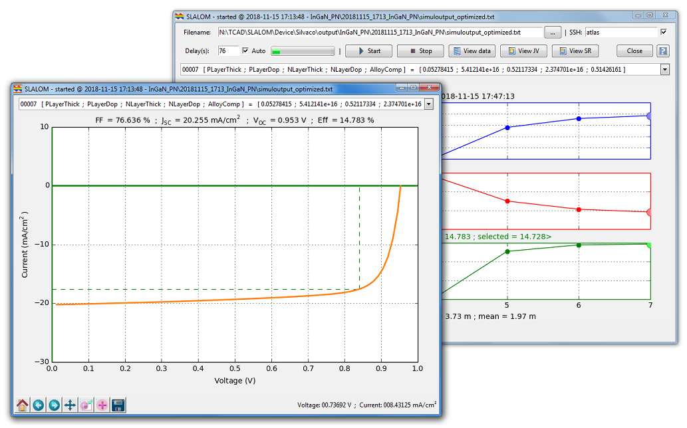

# SLALOM - SoLAr CelL Multivariate OptiMizer

Complete documentation here: [Guide/slalom_guide.pdf](https://github.com/sidihamady/SLALOM/blob/master/Guide/slalom_guide.pdf)

SLALOM  is a set of open-source Python programs implementing 
a rigorous mathematical methods for the optimization of solar cells using as backend 
a drift-diffusion device simulator.

It aims to be simple to use, to maintain and to extend.

It includes a core optimizer using the well tested robust mathematical methods,
a set of user interface utilities and some complete and working examples easily adaptable to
new solar cell technologies.

SLALOM uses, as device simulator, the Silvaco(C) Atlas tool.
It can be easily extended to use any simulator that have a standard input format and a command line interface.

SLALOM source code is available to download from:  
[https://github.com/sidihamady/SLALOM](https://github.com/sidihamady/SLALOM)  
[https://hal.archives-ouvertes.fr/hal-01897934](https://hal.archives-ouvertes.fr/hal-01897934)  
[http://www.hamady.org/photovoltaics/slalom_source.zip](http://www.hamady.org/photovoltaics/slalom_source.zip)  

SLALOM requirements:
* Python version 2.7.x or later
* numpy version 1.5 or later
* scipy version 0.13.1 or later
* matplotlib version 1.3.x or later
* tkinter 8.5 or later (required only for the GUI monitor)

Linux:
* Python is already installed with almost any Linux distribution.
* For RedHat (or clones such as CentOS or Scientific Linux, or Fedora), numpy, scipy and matplotlib can be installed using yum:  
```
sudo yum install python-numpy python-scipy python-matplotlib python-matplotlib-tk python-tools
cd /opt
wget --no-check-certificate https://www.python.org/ftp/python/2.7.12/Python-2.7.12.tar.xz
tar -xvf Python-2.7.12.tar.xz
cd Python-2.7.12
./configure --prefix=/usr/local
make && make altinstall
wget https://bootstrap.pypa.io/get-pip.py
python2.7 get-pip.py
python2.7 -m pip install --upgrade numpy
python2.7 -m pip install --upgrade scipy
```

Windows:
Two methods (at least!) to install Python and scipy/numpy/matplotlib under Windows:  
Method 1:  
* Download Python: [https://www.python.org/downloads/release/python-2712/](https://www.python.org/downloads/release/python-2712/)  
* Choose preferebly Python 2.7.12 and install it  
* install scipy/numpy/matplotlib/tkinter modules [http://www.lfd.uci.edu/~gohlke/pythonlibs/](http://www.lfd.uci.edu/~gohlke/pythonlibs/) using pip (pip install module.whl)  
Method 2:  
Download and install the Anaconda distribution: [https://www.anaconda.com/distribution/](https://www.anaconda.com/distribution/)  
preferably pick Python 2.7 version

See [Guide/slalom_guide.pdf](https://github.com/sidihamady/SLALOM/blob/master/Guide/slalom_guide.pdf) for a complete guide.







